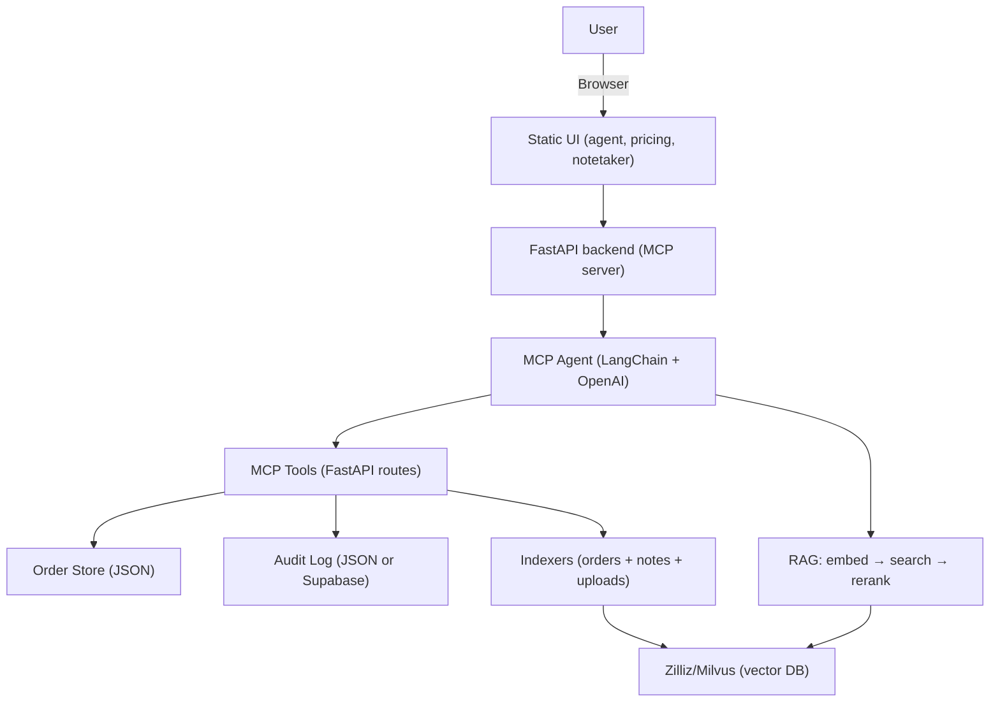

## CPQ Life Sciences Platform – Capstone

This capstone implements an AI-assisted Configure-Price-Quote (CPQ) platform for Contract Research Organizations (CROs). It uses Retrieval-Augmented Generation (RAG) over orders, notes, and uploaded documents to draft quotes, update pricing, and answer questions.

- Live App: [capstone-w85i.onrender.com](https://capstone-w85i.onrender.com/)
- Source: this repository

### Criteria 1: Project Spec

#### System / AI Agent Design


#### Screenshots and Example Queries
- UI screenshots: see `Screenshot 2025-08-20 at 1.44.34 PM.png` in repo root. You can also browse routes:
  - Agent: `/` → serves `src/static/agent.html`
  - Pricing: `/pricing/{ORDER_ID}` → `src/static/pricing.html`
  - Notetaker: `/notetaker` → `src/static/notetaker.html`

Example queries the agent handles (via RAG):
- “Draft a quote for cell sorting using the uploaded PDF.”
- “What’s the typical turnaround time for flow cytometry?”
- “Add a 10% service fee to OD-00023.”
- “Show me Moderna orders last 24 hours and add ‘Moderna Tax $1000’.”
- “Summarize sequencing sample storage requirements and fees.”

#### Business Problem
CROs generate ~20k quotes/month; manual quoting is slow and error-prone. The platform reduces time-to-quote by indexing prior quotes, notes, and artifacts into a vector database and using an agent to draft, modify, and validate quotes rapidly.

### Criteria 2: Write Up

#### Purpose and Expected Outputs
- Purpose: Speed up and improve accuracy for quoting scientific services.
- Outputs:
  - Drafted quotes/orders with items, quantities, costs, subtotals
  - Pricing page for edits and subtotals
  - Quote PDF preview
  - Audit logs of actions

#### Dataset and Technology Choices
- Data:
  - Orders: `data/orders.json` (local JSON store)
  - Freeform notes/transcripts (notetaker ingestion)
  - Uploaded documents: PDF/DOCX/Excel/TXT/MD
- Tech:
  - Backend: FastAPI (also exposes MCP tools)
  - Agent: `mcp-use` + LangChain’s `ChatOpenAI`
  - Embeddings & Chat: OpenAI (`text-embedding-3-small`, `gpt-4o-mini`)
  - Vector DB: Zilliz/Milvus (HTTP APIs)
  - Frontend: Static HTML pages served by FastAPI
  - Deployment: Render (proxied via Vercel rewrites)
  - Reranking: LLM-based prompt reranking
  - Safety: prompt-injection filters, moderation hook, rate limiting

Justifications:
- Milvus/Zilliz offers reliable vector search at scale with simple HTTP APIs.
- `gpt-4o-mini` provides good speed/quality trade-off for reranking and extraction.
- FastAPI + MCP tools keeps all actions auditable and agent-accessible.

#### Steps Followed and Challenges
1) Parse and normalize orders and notes; index into Milvus.
2) Build agent with MCP tools to operate on orders and retrieval.
3) Add RAG retrieval with reranking for higher precision context.
4) Add abuse protection (injection filters, moderation hook, rate limiting).
5) Deploy and add integration tests (5 queries) to validate RAG.

Challenges & Mitigations:
- PDF text extraction variability → robust parsers and fallback skips.
- Prompt injection in retrieved content → filters and agent instructions.
- Latency from reranking → limit initial fetch + small, fast reranker model.

#### Future Enhancements
- Hybrid search (BM25 + vectors), metadata filtering and facets.
- Structured graph retrieval for entity relations (customers → orders → items).
- Human-in-the-loop approval and fine-tuned ranking models.
- Multi-tenant auth and per-tenant Milvus collections.

### Criteria 3: Vectorizing Unstructured Data – Data Quality Checks

Data Sources and Checks (at least 2 per source):

- Uploaded Documents (PDF/DOCX/Excel/TXT/MD) – `src/ingest_milvusfiles.py`
  - Supported types only; unsupported gracefully skipped.
  - Empty text/pages skipped (`extracted.strip()` check for PDFs; blank paragraphs filtered for DOCX).
  - Chunking with overlap for recall; prevents truncation.
  - Embedding errors per-chunk handled; records still written with empty vector if needed.

- Notetaker Transcripts – `src/mcp_server.py#index_notes_in_milvus`
  - Chunking with overlap and skip when no text.
  - Customer name extraction and canonicalization (`_extract_customer_from_notes`, `_canonicalize_customer`).

- Orders Data – `src/mcp_server.py`
  - Item normalization (`_normalize_items`) converting various numeric fields to floats and recomputing `line_total`/`subtotal`.
  - Status transitions validated; cloning/variant creation preserves source data; duplication prevention in bulk add.

- Safety/Sanitization – `src/milvus_connector.py`
  - Query/document sanitization (whitespace normalization, max length caps).
  - Heuristic injection detection to skip suspect chunks or block risky queries.
  - Optional OpenAI moderation gate for disallowed content.

### Criteria 4: RAG Code

This project uses RAG with reranking and tests.

- Retrieval and Embedding
  - Embeddings: `text-embedding-3-small`
  - Retrieval: Zilliz/Milvus HTTP search
  - Code: `src/milvus_connector.py` → `get_embedding`, `search_similar_documents`

- Reranking
  - LLM-based reranker with `gpt-4o-mini` (`ENABLE_RERANKING=true`).
  - Fetch `limit * INITIAL_SEARCH_MULTIPLIER` then rerank to `limit`.

- ≥1000 Embeddings Loaded
  - Ingest a folder of mixed documents to exceed 1000 chunks:
    ```bash
    export OPENAI_API_KEY=sk-...
    export MILVUS_ENABLED=true
    # Place files under milvusfiles/ (PDF/DOCX/XLSX/TXT/MD)
    python src/ingest_milvusfiles.py
    ```
  - Also, indexing orders and notes via app flows contributes additional embeddings.

- Integration Tests (5+ queries)
  - File: `tests/test_rag_integration.py`
  - Run:
    ```bash
    pip install -r requirements.txt
    export OPENAI_API_KEY=sk-...
    # Optional for live retrieval
    # export MILVUS_ENABLED=true
    # export MILVUS_URI=...
    # export MILVUS_TOKEN=...
    pytest -q
    ```

- Abuse Protection Techniques
  - Heuristic injection filters, length caps, optional moderation.
  - Agent tool-guide with RAG safety instructions.
  - Per-IP token-bucket rate limiting middleware.

### Criteria 4: Deployed on a Live Site

- Live link: [capstone-w85i.onrender.com](https://capstone-w85i.onrender.com/)
- Vercel rewrites proxy to the Render backend; static UI served by FastAPI under `/static`.

### Criteria 5: Project Scoping

Real, non-trivial end-to-end use case:
- Users upload quotes/notes, the agent drafts a quote using RAG over prior data, users refine pricing in the UI, and export a PDF. All actions are logged, and new artifacts are indexed back into the RAG store to improve future answers.

---

## Setup & Run

1) Install dependencies:
```bash
pip install -r requirements.txt
```
2) Environment variables:
```bash
export OPENAI_API_KEY=sk-...
export MILVUS_ENABLED=true
export MILVUS_URI=...
export MILVUS_TOKEN=...

# Reranking
export ENABLE_RERANKING=true
export RERANKING_MODEL=gpt-4o-mini
export INITIAL_SEARCH_MULTIPLIER=3

# Safety
export ENABLE_SAFETY_FILTERS=true
export BLOCK_ON_INJECTION=true
export ENABLE_OPENAI_MODERATION=false

# Rate limiting
export RATE_LIMIT_RPS=3
export RATE_LIMIT_BURST=6
```
3) Run the server locally:
```bash
python -m uvicorn src.mcp_server:app --reload --port 8000
```
4) Try a search:
```bash
curl -s -X POST 'http://localhost:8000/v1/search?query=flow cytometry' | jq .
```

## Verification Checklist (Rubric)
- Project spec: diagram, screenshots, business problem documented above.
- Write-up: purpose, outputs, datasets/tech choices w/ justifications, steps, challenges, future work.
- Vectorization: ≥2 data-quality checks per source (docs, notes, orders, safety).
- RAG code: reranking enabled; ≥1000 embeddings steps provided; 5-query tests; abuse protections.
- Deployed: live link provided.
- Scope: end-to-end CRO quoting workflow implemented.


